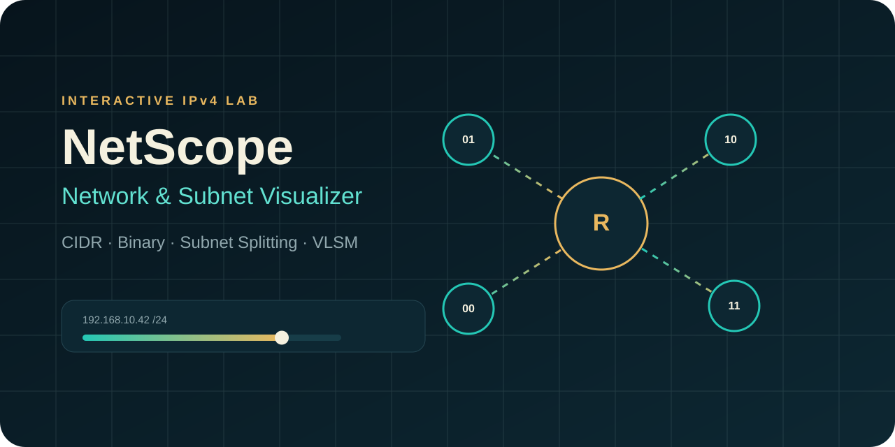

# NetScope — Network & Subnet Visualizer

NetScope is an interactive **IPv4 subnet calculator, binary visualizer, subnet splitter, and VLSM planner** built with HTML, CSS, and vanilla JavaScript.

It is designed as a portfolio project that demonstrates both frontend development and networking fundamentals without relying on a framework or backend.

## Live Demo

Add your GitHub Pages URL here after deployment.

## Preview



Open `index.html` locally or deploy the repository with GitHub Pages.

## Features

### IPv4 subnet analysis
- IPv4 + CIDR validation
- Network address
- Broadcast address
- First and last usable address
- Total and usable address counts
- Subnet mask
- Wildcard mask
- Address scope classification
- Legacy address class display
- Position of the selected IP inside its subnet

### Binary visualization
- Full 32-bit IPv4 representation
- Network bits and host bits shown separately
- Dynamic update for every CIDR prefix

### Subnet splitter
- Split the current CIDR block into smaller networks
- Preview network, usable range, and broadcast address
- Handles large split counts while limiting rendered rows for performance

### VLSM planner
- Accepts named host requirements
- Allocates largest networks first
- Produces CIDR, network, host range, broadcast, and wasted-host calculations
- Detects when the selected base network is too small

### Portfolio-oriented extras
- Dark/light theme
- Shareable query-string URL
- JSON export
- Copyable calculation summary
- Responsive design
- No external dependencies
- Calculations run entirely in the browser

## Tech Stack

- HTML5
- CSS3
- Vanilla JavaScript
- Web Storage API
- Clipboard API
- Blob / File download APIs
- URL and URLSearchParams APIs

## Project Structure

```text
netscope-network-subnet-visualizer/
├── assets/
├── tests/
│   └── network.test.js
├── app.js
├── index.html
├── network.js
├── README.md
├── LICENSE
└── styles.css
```

## Architecture

`network.js` contains the deterministic networking logic and can run both in the browser and in Node.js.

`app.js` contains DOM rendering, user interaction, export, copy, theme, and URL state logic.

Keeping the networking calculations separate makes the project easier to test and maintain.

## Run Locally

No build step is required.

1. Clone or download the repository.
2. Open `index.html` in a browser.

For development, VS Code with Live Server is convenient but not required.

## Run Tests

If Node.js is installed:

```bash
node tests/network.test.js
```

The tests cover representative subnet calculations, `/31`, `/32`, splitting, and VLSM allocation.

## Example

For:

```text
192.168.10.42/24
```

NetScope calculates:

```text
Network:   192.168.10.0/24
Broadcast: 192.168.10.255
Usable:    192.168.10.1 - 192.168.10.254
Mask:      255.255.255.0
Wildcard:  0.0.0.255
```

## Networking Notes

- `/31` is treated as two usable point-to-point addresses in line with RFC 3021.
- `/32` is treated as a single host route.
- The VLSM planner uses traditional subnet sizing with network and broadcast addresses, so host requirements are allocated into `/30` or larger networks.

## What This Project Demonstrates

- IPv4 subnet math
- CIDR reasoning
- VLSM allocation
- deterministic calculation logic
- input validation
- DOM rendering
- responsive UI design
- separation of calculation logic from UI logic
- testable JavaScript
- browser storage and Web APIs

## Disclaimer

NetScope is an educational and portfolio tool. Production network changes should be independently verified.

## License

MIT
